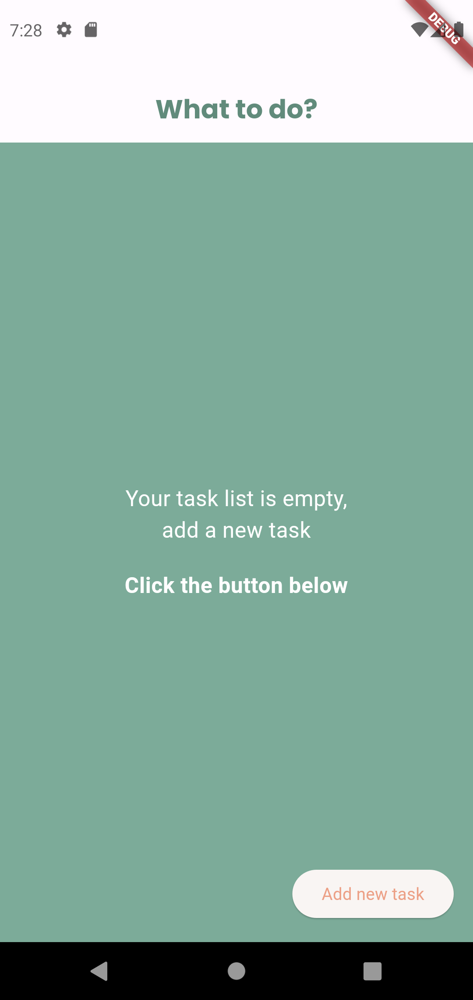
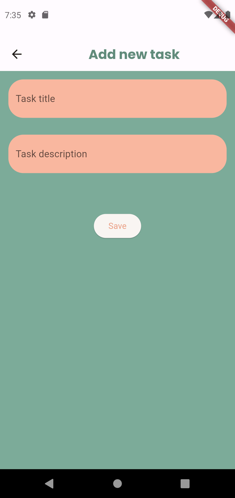
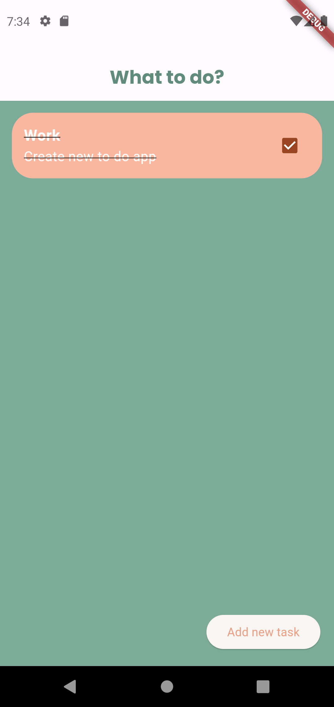
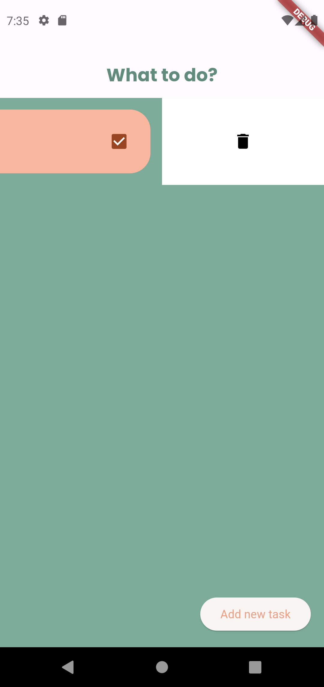

# What To Do

A new Flutter project for managing tasks and staying organized.

## Description

"What To Do" is a Flutter project that helps you manage your tasks and stay organized. It provides a user-friendly interface to add and delete tasks and track progress.

## Features

The project includes the following features:

- Task management: Add and delete tasks.
- User-friendly interface: Intuitive and easy-to-use interface for better user experience.

## Screenshots

## Getting Started

To get started with this project, follow these steps:

1. Clone the repository: `git clone https://github.com/Aduzja/what_to_do.git`
2. Navigate to the project directory: `cd what_to_do`
3. Run `flutter pub get` to install the dependencies.
4. Connect your device or emulator.
5. Run `flutter run` to start the app.

## Dependencies

The project uses the following dependencies:

- Flutter SDK: `>=3.0.5 <4.0.0`
- cupertino_icons: ^1.0.2
- flutter_slidable: ^3.0.0
- hive: ^2.2.3
- hive_flutter: ^1.1.0
- flutter_native_splash: ^2.3.1
- icons_launcher: ^2.1.3

For a complete list of dependencies, see the [pubspec.yaml](pubspec.yaml) file.

## Contributing

Contributions are welcome! If you have any ideas, suggestions, or bug reports, please open an issue or submit a pull request.
